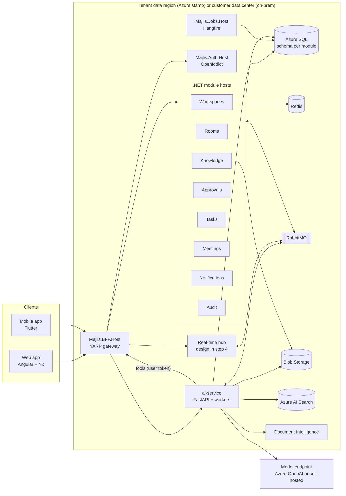
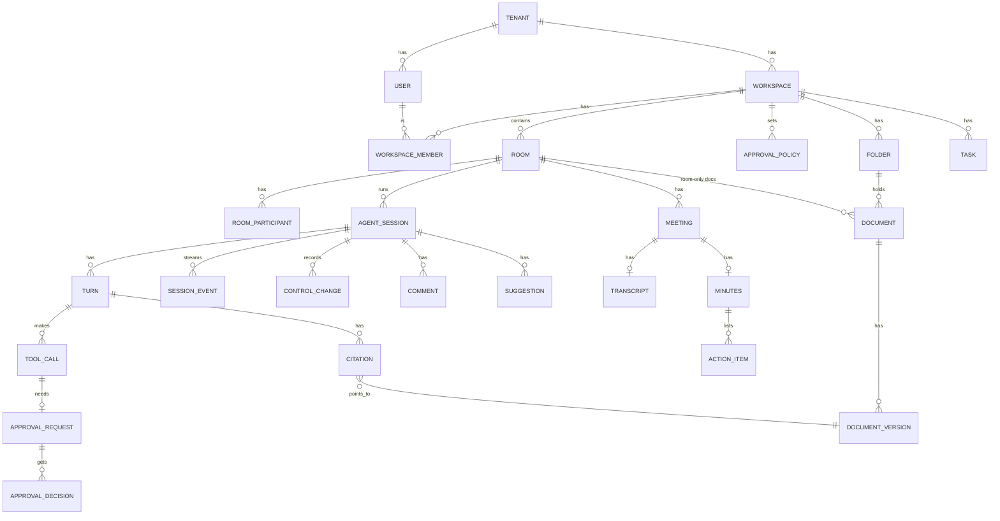

# Majlis · مجلس — Software Requirements Specification

| | |
|---|---|
| Version | 0.2 |
| Date | 2026-10-08 |
| Status | Reviewed. OD-1…OD-3 decided by the product owner (2026-10-09); the other assumptions in §2.4 accepted as proposed |
| Scope | Web app (MVP), AI service, backend; mobile from v1.1 |

Requirement ids are stable (`FR-ROOM-004`, `AI-RAG-002`, `NFR-SEC-010`) so code, tests and PRs can reference them. Priority uses MoSCoW: **M** must (MVP), **S** should (MVP if time allows, else v1.1), **C** could (later), **W** won't (this release).

---

## 1. Vision

**Majlis (مجلس)** is where a team sits together with an AI agent. The name comes from the *majlis*, the room where people gather, discuss and decide together. The product brings that idea to AI work.

Today, AI assistants are single-player: one person, one chat, one private history. Teams copy answers into email, re-explain context, and nobody can tell what the AI did or who approved it. Majlis makes the agent session **shared, visible and accountable**:

- **Shared:** several people watch the same agent session live, steer it, comment on it, take control, and hand it over.
- **Grounded:** the agent answers from the team's own documents, with citations to the exact page, and says when it doesn't know.
- **Accountable:** the agent proposes; people approve. Every change to data waits for a human decision, and every step is in the audit log.
- **Arabic-first:** Arabic is the default language, with full RTL, formal Modern Standard Arabic answers, and Arabic-aware search. English is fully supported.
- **Sovereign:** each customer chooses where its data lives — a cloud region of its choice (Saudi Arabia among them) or its own data center (on-premises) — built for the controls Saudi and GCC organizations must meet.

### 1.1 Goals (first 12 months)

| Id | Goal | Measure |
|---|---|---|
| G-1 | Teams do real work together with the agent | ≥ 40% of active rooms have 2+ participants in a session per week |
| G-2 | Answers can be trusted | groundedness ≥ 0.9 and refusal accuracy ≥ 0.9 on the Arabic and English eval sets |
| G-3 | Agent actions are safe | 100% of mutating actions have an approval record; 0 unapproved writes |
| G-4 | Enterprise-ready | pass the pilot customers' security reviews on the cloud service |
| G-5 | Adoption | 3 paying pilot organizations live by end of MVP + 3 months |

### 1.2 Non-goals

- A general consumer chatbot.
- Replacing the customer's document management system; Majlis indexes and cites documents, it is not the system of record for them (except agent drafts).
- Fully autonomous agents that change data without a person.
- Handling data classified **Secret** or **Top Secret** under the national data classification (see §6.2).

---

## 2. Context

### 2.1 Target market

Teams in Saudi Arabia and the GCC:

| Segment | Typical use |
|---|---|
| Government entities | policy and regulation Q&A, drafting memos and responses, meeting minutes, follow-up tasks |
| Consulting firms | client research across engagement documents, drafting deliverables, workshop summaries |
| Legal teams | clause search across contracts and regulations with citations, first-draft memos, review checklists |
| Operations teams | SOP lookup, incident summaries, task follow-up, shift handovers |

### 2.2 Glossary

| Term | Arabic | Meaning |
|---|---|---|
| Tenant / organization | جهة / منظمة | one customer; owns users, workspaces, billing |
| Workspace | مساحة عمل | a team area inside a tenant (e.g. "Legal Affairs"); owns rooms, documents, members |
| Room | غرفة / مجلس | a topic or project space inside a workspace where people and the agent work |
| Session | جلسة | one run of the AI agent inside a room; a room has many sessions over time |
| Turn | دور | one instruction to the agent and its response (text, tool calls, citations) |
| Driver | المتحكم | the one participant currently in control of the session (§5.3) |
| Participant | مشارك | a person in the room who can watch, comment and suggest |
| Approval request | طلب اعتماد | a proposed agent action that changes data, waiting for a human decision |
| Knowledge | المعرفة | the documents the agent may search for a workspace or room |
| Citation | استشهاد | a link from an answer sentence to a source document page |

### 2.3 Constraints

- **Stack is fixed** by the house skills: .NET 10 modular backend (`backend/`), Angular 22 + Nx (`frontend/`), Flutter (`mobile/`), Python FastAPI + Azure OpenAI + Azure AI Search (`ai-service/`).
- **Only the AI service calls models.** Clients and .NET never hold model keys.
- **Cloud first.** The product is built, tested and shipped for the `cloud` profile (Azure, multi-tenant, regional). Every Azure-specific service sits behind an adapter so an `on-prem` profile (customer data center, single tenant) can be added later without rewriting business code (§7.1, ADR-0006). Region rules are in §6.2.

### 2.4 Assumptions and open decisions

These were the open questions asked before writing this SRS. **OD-1…OD-3 were decided by the product owner on 2026-10-09; OD-4…OD-9 were accepted as proposed.** The requirements below follow these decisions.

| Id | Question | Decision | Impact if changed |
|---|---|---|---|
| OD-1 | Deployment model | **Decided:** **cloud SaaS is always the priority** (multi-tenant, regional). **On-premises** (single tenant in the customer's data center) must stay possible: Azure services are used only through adapters from day one, and the on-prem implementations and installer are built once the first on-prem customer is confirmed | Every Azure service needs an on-prem equivalent behind an adapter (§7.1) and every release is tested on both profiles |
| OD-2 | Where data and model inference run | **Decided:** start with **private-sector customers, in any country**. Each cloud tenant has a **data region** chosen at provisioning; all its data stays there. Inference runs in the same region when the model is available there, otherwise in an approved region with the customer's written consent. On-prem customers keep everything in their own data center (§6.2) | Saudi Arabia East becomes one region option, used for Saudi customers once its services are confirmed |
| OD-3 | Compliance targets at launch | **Decided:** PDPL, NCA ECC-2:2024 and CCC-2:2024 for Saudi customers, local data-protection law for customers elsewhere, and data classification up to **Restricted**. **To be reviewed again before go-live** with real customers | Higher classification levels need on-prem or dedicated deployments |
| OD-4 | Sign-in | Email + password with mandatory MFA (TOTP), plus enterprise SSO through OIDC (Microsoft Entra ID) and SAML 2.0. **Nafath** on the roadmap | Nafath is likely required for some government customers |
| OD-5 | Meetings | MVP summarizes **uploaded** recordings and transcripts (and pasted notes). Joining live Teams/Zoom calls is v2 | Live joining needs bot infrastructure per meeting platform |
| OD-6 | Business model | Per-seat subscription per tenant, plans with AI usage quotas, 14-day trial. Invoicing handled manually in MVP; online billing later | Usage-based pricing would need metering exposed in-product |
| OD-7 | Integrations in MVP | Native upload only. SharePoint / OneDrive sync in v1.1, Microsoft Teams app in v2 | SharePoint in MVP would add Graph connector + permission sync work |
| OD-8 | Tool targets | Tasks and drafts live **inside Majlis**. Drafts export to `.docx` and PDF. Jira / Planner / Word online push later | External tools need per-integration OAuth and approval mapping |
| OD-9 | Session control | **One driver at a time.** Others watch, comment and *suggest* instructions; the driver can accept a suggestion, hand off, or a participant can request or (with permission) take control. Driver-absence timeout is configurable (§FR-SES-010) | Multiple simultaneous drivers would need instruction merging and conflict rules |

---

## 3. Personas and roles

### 3.1 Personas

| Persona | Context | Needs | Frustrations today |
|---|---|---|---|
| **Sara — engagement manager** (consulting) | runs 3 client engagements, 6-person team | shared research with the team, client deliverable drafts with sources | everyone pastes from their own ChatGPT tab; no shared context, no citations |
| **Khalid — department director** (government) | approves outgoing memos and decisions | see what the AI did and why, approve or reject quickly, from phone too | can't trust AI output he can't trace; worried about data leaving the Kingdom |
| **Noura — legal associate** (legal) | searches contracts and regulations daily | precise clause citations in Arabic, comparisons, first-draft memos | keyword search misses Arabic spelling variants; generic AI invents articles |
| **Faisal — operations coordinator** (operations) | shift handovers, incident follow-up | meeting summaries turned into assigned tasks, SOP answers | action items get lost between meetings and task tools |
| **Abdullah — IT / security admin** (any) | owns identity, compliance and vendor reviews | SSO, audit export, data residency evidence, retention settings | AI tools are shadow IT with no audit trail |

### 3.2 Roles and permissions

Roles are assigned at three levels. Permissions are named `Permissions.{Module}.{Action}{Entity}` (see `backend/CLAUDE.md`) and checked identically in backend, web and mobile.

**Tenant level**

| Role | Can |
|---|---|
| Tenant owner | everything in the tenant, billing, delete tenant, transfer ownership |
| Tenant admin | users, groups, SSO, policies (approvals, retention, residency evidence), create workspaces, view audit |
| Auditor | read-only audit log and usage reports across the tenant; cannot read room content unless also a member |
| Member | join workspaces they are added to |
| Guest | external user (e.g. a client); only the specific rooms they are invited to; cannot see workspace knowledge outside those rooms |

**Workspace level**

| Role | Can |
|---|---|
| Workspace owner | manage members and roles, delete workspace, approval policies for the workspace |
| Workspace admin | manage members, rooms and knowledge; approve actions |
| Contributor | create rooms, upload documents, drive sessions, approve actions within policy |
| Viewer | read rooms and knowledge, comment; cannot drive or approve |

**Room level** (session state, not a stored role): **Driver** (in control), **Participant** (watch, comment, suggest, request control), **Observer** (watch only — viewers and guests with read-only invite).

Approval rights are a separate permission (`Permissions.Approvals.ApproveAction`) granted per workspace and narrowed by approval policies (§4.5).

---

## 4. Functional requirements

Grouped by backend module (provisional list in `backend/CLAUDE.md`, final in the step 4 architecture review).

### 4.1 Identity and tenancy (`Identity`)

| Id | Requirement | P |
|---|---|---|
| FR-IDN-001 | Users sign in with email + password; MFA (TOTP) is mandatory for all users in production tenants | M |
| FR-IDN-002 | Tenant admins configure SSO with OIDC (Microsoft Entra ID, ADFS) and SAML 2.0; on-prem installations can also use LDAP / Active Directory. When SSO is enforced, password sign-in is disabled for that tenant's domain | M |
| FR-IDN-003 | Just-in-time user provisioning from SSO; SCIM 2.0 provisioning and deprovisioning | S / C |
| FR-IDN-004 | Nafath sign-in | C |
| FR-IDN-005 | Tenant admins invite users by email, deactivate users (sessions revoked within 5 minutes), and manage groups | M |
| FR-IDN-006 | Each user sets language (ar/en), calendar display (Gregorian / Hijri / both), digit style, theme (light/dark/dim), and notification preferences | M |
| FR-IDN-007 | Tenant settings: name (ar/en), logo, allowed email domains, data region and inference consent (read-only, set at provisioning), retention periods, default approval policy, driver-absence timeout | M |
| FR-IDN-008 | Guest users are invited to specific rooms only, are visibly marked as guests everywhere, and expire after a configurable period (default 90 days) | S |
| FR-IDN-009 | Session management: list active sign-ins, sign out other devices | S |

### 4.2 Workspaces (`Workspaces`)

| Id | Requirement | P |
|---|---|---|
| FR-WSP-001 | Tenant admins and allowed members create workspaces with a name, description, icon and color | M |
| FR-WSP-002 | Workspace owners add/remove members and groups and assign workspace roles (§3.2) | M |
| FR-WSP-003 | A workspace has its own knowledge base, rooms, tasks and approval policy | M |
| FR-WSP-004 | Workspace home shows rooms (recent, active now with live presence), pending approvals for me, my tasks, recent documents | M |
| FR-WSP-005 | Archive and restore a workspace; archived workspaces are read-only | S |
| FR-WSP-006 | Workspace-level agent instructions ("house style", glossary, tone) added to every session's system context | S |

### 4.3 Rooms and shared agent sessions (`Rooms`)

The core of the product.

**Rooms**

| Id | Requirement | P |
|---|---|---|
| FR-ROOM-001 | Contributors create rooms in a workspace with a name, purpose, members (subset of workspace or all), and knowledge scope (whole workspace knowledge, selected folders, or room-only documents) | M |
| FR-ROOM-002 | A room shows: the live session, the session history, room documents, room tasks, pending approvals, participants with presence | M |
| FR-ROOM-003 | Rooms can be private (invited members only) or open to all workspace members | M |
| FR-ROOM-004 | Pin messages and answers; star rooms; search across rooms the user can access (titles, messages, answers) | S |
| FR-ROOM-005 | Archive a room (read-only), export the room transcript with citations to PDF/DOCX | S |

**Sessions**

| Id | Requirement | P |
|---|---|---|
| FR-SES-001 | A room has at most **one active session** at a time; previous sessions remain readable as history | M |
| FR-SES-002 | Any contributor in the room can start a session; the starter becomes the driver | M |
| FR-SES-003 | Everyone in the room sees the session **live**: agent text as it streams, retrieval steps ("searching 3 documents…"), tool calls, citations, approvals, and who sent each instruction | M |
| FR-SES-004 | The **driver** sends instructions, can **stop** the agent mid-response, and can **redirect** (stop + new instruction in one action) | M |
| FR-SES-005 | Participants post **comments** on the session timeline or on a specific turn/answer, with @mentions; comments are visible to the room but are **not** sent to the agent unless the driver includes them | M |
| FR-SES-006 | Participants post **suggestions** (proposed instructions). The driver sees them queued and can send as-is, edit-then-send, or dismiss | M |
| FR-SES-007 | A participant can **request control**; the driver accepts or declines. If the driver doesn't respond within 60 s (configurable), the request stays pending | M |
| FR-SES-008 | The driver can **hand off** control to a named participant. The receiver must accept; the hand-off can include a short note shown in the timeline | M |
| FR-SES-009 | Users with `Permissions.Rooms.TakeOverSession` (workspace admins by default) can **take over** control without consent; the previous driver is notified and the event is audited | M |
| FR-SES-010 | If the driver disconnects for longer than the **driver-absence timeout**, control becomes **free**; any contributor can claim it. The timeout is a tenant setting (default 2 min, range 30 s – 30 min) that a workspace can override | M |
| FR-SES-011 | The agent runs with the **permissions of the current driver**. When control changes, the next turn uses the new driver's permissions and knowledge access; retrieval for that turn is filtered by the new driver's access | M |
| FR-SES-012 | A session can be **handed to a colleague asynchronously**: the session stays open, the colleague gets a notification with the hand-off note and a summary of the session so far | M |
| FR-SES-013 | Session summary: on demand, and automatically when a session ends, the agent writes a summary with decisions, open questions and created items | S |
| FR-SES-014 | Late joiners see a "catch me up" summary of what happened before they joined | S |
| FR-SES-015 | Reactions (👍, ✅, ❓) on turns and comments | C |
| FR-SES-016 | Branch: start a new session from any earlier turn, keeping context up to that point | C |

**Presence**

| Id | Requirement | P |
|---|---|---|
| FR-PRS-001 | Show who is in the room now (avatar stack), who is the driver, who is typing a comment or suggestion | M |
| FR-PRS-002 | Workspace and room lists show live "active now" indicators and participant counts | M |
| FR-PRS-003 | Optional "following" indicator: which turn each participant is viewing | C |

### 4.4 Knowledge (`Knowledge`)

| Id | Requirement | P |
|---|---|---|
| FR-KNW-001 | Upload documents to a workspace (folders) or a room: PDF (digital and scanned), DOCX, XLSX, PPTX, TXT, MD, images (PNG/JPG). Max 100 MB per file (configurable) | M |
| FR-KNW-002 | Each document shows ingestion status (queued, processing, indexed, failed with reason) updated live | M |
| FR-KNW-003 | Access control: a document inherits its folder/room permissions; admins can restrict a folder to groups. The agent only retrieves what the **current driver** may read | M |
| FR-KNW-004 | Versions: re-uploading replaces the indexed version; older versions remain downloadable and old citations show "superseded" | M |
| FR-KNW-005 | Metadata: title, document type (regulation, contract, policy, SOP, report, other), language (auto-detected), effective date, tags | M |
| FR-KNW-006 | Document viewer with page navigation; opening a citation jumps to the cited page and highlights the passage | M |
| FR-KNW-007 | Delete a document: removed from the index within 5 minutes; past answers keep the citation text but mark the source as deleted | M |
| FR-KNW-008 | Smart search screen (retrieval without generation) with filters | S |
| FR-KNW-009 | Agent **drafts** (from `draft_document`) are stored as Majlis documents with status Draft → Approved; approved drafts can be added to knowledge and exported to DOCX/PDF | M |
| FR-KNW-010 | SharePoint / OneDrive folder sync with permission mapping | C (v1.1) |
| FR-KNW-011 | Workspace glossary (term ↔ translation ↔ definition) used in query rewriting and answers | S |

### 4.5 Approvals (`Approvals`)

| Id | Requirement | P |
|---|---|---|
| FR-APR-001 | Every agent tool that changes data creates an **approval request** before anything changes. No mutating tool runs without an `Approved` decision | M |
| FR-APR-002 | An approval request shows: the action in plain language (ar/en), the exact changes (field-level preview or document diff), the reason the agent gave, the session turn and driver that led to it, and the risk level | M |
| FR-APR-003 | Approvers can **approve**, **reject** (with reason), or **edit then approve**; edits are recorded with before/after | M |
| FR-APR-004 | Approval appears inline in the room (all participants see it live) and in the approver's inbox; push/email notification when the approver is not in the room | M |
| FR-APR-005 | Approval **policies** per workspace by tool and risk level: who may approve (driver, any contributor, specific roles/groups), number of approvals (1 or 2), whether the requester may self-approve. Default: low risk → driver may approve; high risk → another approver required | M |
| FR-APR-006 | Requests expire after 24 hours (configurable); expired requests never execute | M |
| FR-APR-007 | After approval, the owning module executes the action idempotently and reports success/failure back into the session timeline | M |
| FR-APR-008 | Bulk approval for multiple similar requests from one turn (e.g. 8 tasks from a meeting) with per-item deselect | S |
| FR-APR-009 | Approver inbox: filter by workspace, room, risk, age; approve from mobile | M (web) / S (mobile) |

Risk levels (initial): **low** — create a task, save a draft; **medium** — update/assign tasks, add a draft to knowledge; **high** — anything sent outside Majlis (email, export to external system), deleting data. Destructive tools are not in MVP.

### 4.6 Tasks (`Tasks`)

| Id | Requirement | P |
|---|---|---|
| FR-TSK-001 | Tasks with title, description, assignee, due date (Gregorian/Hijri display), priority, status (to do, in progress, done, cancelled), workspace and optional room/session link | M |
| FR-TSK-002 | Created manually or by the agent (`create_task`, after approval); agent-created tasks show their source turn and approval | M |
| FR-TSK-003 | My tasks, room tasks, workspace task board (list and kanban); filters and export | M |
| FR-TSK-004 | Assignees are notified; due-date reminders | M |
| FR-TSK-005 | Push tasks to Jira / Microsoft Planner | C |

### 4.7 Meetings (`Meetings`)

| Id | Requirement | P |
|---|---|---|
| FR-MTG-001 | Create a meeting record in a room: title, date, attendees; upload a recording (m4a, mp3, wav, mp4, webm; ≤ 2 hours / 500 MB) or a transcript (VTT, DOCX, TXT), or paste notes | M |
| FR-MTG-002 | Transcription in Arabic (incl. Gulf dialect speech to MSA text where possible) and English, with speaker separation where supported; status shown live | M |
| FR-MTG-003 | The agent produces minutes: summary, decisions, action items (owner, due date), open questions — in the meeting's language or the user's chosen language | M |
| FR-MTG-004 | Action items become task approval requests in bulk (FR-APR-008) | M |
| FR-MTG-005 | Minutes can be edited, approved, exported (DOCX/PDF) and added to knowledge | M |
| FR-MTG-006 | Record directly in the browser / mobile app | S |
| FR-MTG-007 | Live meeting join (Teams/Zoom bot) | W (v2) |

### 4.8 Notifications (`Notifications`)

| Id | Requirement | P |
|---|---|---|
| FR-NTF-001 | In-app notification center (live): mentions, hand-off requests, approval requests and decisions, task assignments, ingestion failures | M |
| FR-NTF-002 | Email notifications (ar/en templates per user language) with per-type preferences and a daily digest option | M |
| FR-NTF-003 | Mobile push notifications with deep links | S (with mobile) |
| FR-NTF-004 | Quiet hours and weekend days per user (default Friday–Saturday) | S |

### 4.9 Audit (`Audit`)

| Id | Requirement | P |
|---|---|---|
| FR-AUD-001 | Append-only audit log of: sign-ins and failures, role/permission changes, session start/end, control changes (request, hand-off, take-over), every agent tool call (proposed, approved, rejected, executed, failed), document upload/delete/download, exports, settings changes | M |
| FR-AUD-002 | Each entry: timestamp (UTC), tenant, actor (user or "agent on behalf of user"), action, target, IP, user agent, correlation id, result | M |
| FR-AUD-003 | Auditors and tenant admins search, filter and export the audit log (CSV/JSON) | M |
| FR-AUD-004 | Audit entries are tamper-evident (hash chain per tenant) and retained ≥ 1 year (configurable up to 7) | S |
| FR-AUD-005 | Stream audit to customer SIEM (syslog / Azure Event Hub / webhook) | C |

### 4.10 Administration, usage and billing

| Id | Requirement | P |
|---|---|---|
| FR-ADM-001 | Usage dashboard (ECharts): active users, sessions, AI tokens and estimated cost by workspace/feature, documents indexed, approvals by outcome | M |
| FR-ADM-002 | Plans with seat limit and AI quota (tokens/month); soft warning at 80%, configurable hard stop at 100% | M |
| FR-ADM-003 | Retention settings: session content (default 365 days), meeting recordings (default 30 days after transcription), audit (§FR-AUD-004) | M |
| FR-ADM-004 | Data export of a whole tenant (documents, sessions, tasks, audit) and tenant deletion with certificate of deletion | S |
| FR-ADM-005 | Platform (internal) admin console: provision tenants, set data region and inference consent, plan, quotas; support access only with tenant-admin-granted, time-boxed, audited consent. On-prem installations have a local admin console instead, with license-file activation | M |

---

## 5. AI requirements

All AI requirements are implemented in `ai-service/` following `.claude/skills/python-azure-rag-service`.

### 5.1 Retrieval and grounded answers (RAG)

| Id | Requirement | P |
|---|---|---|
| AI-RAG-001 | Ingestion: layout extraction (incl. scanned Arabic) — Document Intelligence on the cloud profile, the on-prem extractor otherwise (§7.1) — structure-aware chunking (400–800 tokens, 10–15% overlap, never splitting table rows or numbered articles), heading paths ("الباب الثالث › المادة 12") | M |
| AI-RAG-002 | Arabic normalization on a search copy (alef forms, ya/alef maqsura, tatweel, diacritics, digits) while the original text is kept for display and citation | M |
| AI-RAG-003 | Hybrid retrieval (BM25 with Arabic / English analyzers + vectors) + re-ranking (Azure AI Search semantic ranker on cloud, OpenSearch + self-hosted re-ranker on-prem); cross-lingual: an English question can retrieve Arabic sources and vice versa | M |
| AI-RAG-004 | Security trimming on every query: tenant + ACL filter derived from the **current driver's** token, never from the request body or the model | M |
| AI-RAG-005 | Every factual sentence cites `[S#]`; citations resolve to document, version, page and passage, and open in the viewer | M |
| AI-RAG-006 | When sources do not support an answer, the agent says it doesn't know and suggests what to upload or whom to ask. It never invents article numbers, dates or names | M |
| AI-RAG-007 | Answer language follows the latest instruction's language; Arabic answers use formal MSA; mixed-language documents are cited in their original language with a translation when asked | M |
| AI-RAG-008 | Retrieval scope follows the room's knowledge scope (FR-ROOM-001); the user can narrow per question ("only in contract X") | M |
| AI-RAG-009 | Compare documents (e.g. two contract versions, policy vs regulation) with a cited side-by-side table | S |

### 5.2 Agent and tools

| Id | Requirement | P |
|---|---|---|
| AI-AGT-001 | One agent loop per session turn: rewrite → retrieve → generate → tool calls → repeat, max 5 iterations and an overall timeout (90 s, configurable) | M |
| AI-AGT-002 | The agent's steps are emitted as session events (thinking status, searches with document names, tool proposals, citations, done) so every participant sees them live | M |
| AI-AGT-003 | Session context = workspace instructions + room purpose + trimmed recent turns + running summary + (if the driver chooses) selected comments/suggestions. Comments not chosen are never sent to the model | M |
| AI-AGT-004 | The driver can stop generation at any point; partial output is kept and marked as stopped | M |
| AI-AGT-005 | Tools declare name, description, strict JSON schema, `required_permission`, `mutates`, `risk`. Mutating tools always return `confirm_required` and create an approval request (FR-APR-001) | M |
| AI-AGT-006 | MVP tools: `search_knowledge`, `get_document`, `list_tasks`, `create_task` (mutates, low), `update_task` (mutates, medium), `draft_document` (mutates, low), `summarize_meeting`, `extract_action_items`, `list_room_participants` | M |
| AI-AGT-007 | The model never chooses `tenant_id`, `user_id`, or the approver; those come from the session and token | M |
| AI-AGT-008 | After an approval decision, the agent is told the outcome (approved / edited / rejected with reason) and continues accordingly; it does not re-propose a rejected action unless asked | M |
| AI-AGT-009 | Long-running tasks (e.g. "draft a 20-page report from these 30 documents") run in background mode with progress shown in the room | S |

### 5.3 Shared-session behaviour

| Id | Requirement | P |
|---|---|---|
| AI-SHR-001 | Each turn records the instructing user; the agent addresses that user and is aware of other participants by display name only | M |
| AI-SHR-002 | Control change mid-turn: the running turn completes (or is stopped by the old driver); the next turn uses the new driver's identity and access | M |
| AI-SHR-003 | Hand-off summary (FR-SES-012) and catch-me-up (FR-SES-014) are generated by the `fast` model from the session events, cited where they restate sources | M / S |

### 5.4 Safety

| Id | Requirement | P |
|---|---|---|
| AI-SAF-001 | Content filtering on every model call (Azure content filters on cloud, the self-hosted guard model on-prem); blocked content returns a localized message and the category is logged without the text | M |
| AI-SAF-002 | Jailbreak and injection detection (Prompt Shields on cloud, the guard model on-prem) on user input (jailbreak) and on retrieved chunks and tool outputs (indirect injection) | M |
| AI-SAF-003 | Retrieved text and tool output are data, never instructions; they cannot widen tool permissions | M |
| AI-SAF-004 | PII redaction in logs and traces (national ID / iqama, phone, email, IBAN) | M |
| AI-SAF-005 | All AI output is labelled as AI-generated in every UI and export | M |
| AI-SAF-006 | Users can report a bad answer (wrong, unsafe, missing citation); reports go to a review queue and feed the eval set | S |

### 5.5 Quality, cost and models

| Id | Requirement | P |
|---|---|---|
| AI-EVL-001 | Eval sets `majlis_ar` and `majlis_en` (≥ 50 questions each, incl. unanswerable ones) per pilot domain (legal, government policy, operations); CI fails below thresholds: recall@5 ≥ 0.85, groundedness ≥ 0.9, refusal accuracy ≥ 0.9, language match ≥ 0.98 | M |
| AI-EVL-002 | Prompt files are versioned; a new version must pass the eval before it is switched on | M |
| AI-CST-001 | Per-request usage metering (tenant, user, feature, deployment, input/output/cached tokens, cost); quotas per tenant and user | M |
| AI-CST-002 | Model roles (`chat`, `fast`, `reasoning`, `embed`, `stt`) map to model endpoints by configuration per deployment profile and tenant data region (Azure OpenAI deployments or OpenAI-compatible self-hosted endpoints) | M |

---

## 6. Non-functional requirements

### 6.1 Security

| Id | Requirement |
|---|---|
| NFR-SEC-001 | All traffic over TLS 1.2+; HSTS; only the BFF is internet-facing; module hosts and ai-service are on private networking |
| NFR-SEC-002 | OAuth 2.0 authorization code + PKCE for web and mobile; access tokens ≤ 15 min; refresh token rotation; tokens never in URLs or local storage on web (BFF cookie or in-memory) |
| NFR-SEC-003 | Authorization checked server-side on every request and every real-time message; real-time subscriptions re-checked on permission change |
| NFR-SEC-004 | Tenant isolation: tenant id from the token in every query (EF global filters, search filters); automated cross-tenant access tests in CI |
| NFR-SEC-005 | Encryption at rest for all stores (cloud: platform-managed keys, customer-managed keys in Key Vault on request; on-prem: the customer's disk/database encryption and key management); `[Sensitive]` fields additionally encrypted at column level |
| NFR-SEC-006 | Secrets only in a secret store (cloud: Azure Key Vault + managed identities; on-prem: Kubernetes secrets or HashiCorp Vault); no keys in code, config files or clients |
| NFR-SEC-007 | Uploaded files: type checks by magic bytes, size limits, malware scanning before ingestion |
| NFR-SEC-008 | OWASP ASVS level 2 for web/API; SAST, dependency and container scanning in CI; annual third-party penetration test before GA |
| NFR-SEC-009 | Rate limiting per user and tenant on API, real-time and AI endpoints |
| NFR-SEC-010 | Support access to tenant data only with tenant-admin consent, time-boxed and audited (FR-ADM-005) |
| NFR-SEC-011 | Map controls to NCA ECC-2:2024 and CCC-2:2024 (provider and tenant tracks) and keep the mapping in `docs/compliance/` |

### 6.2 Data residency and privacy

Majlis starts with **private-sector customers in any country** (OD-2) and supports **on-premises** installations (OD-1). Residency is therefore a property of each tenant, not of the whole product.

**Cloud profile.** Majlis runs one *regional stamp* (the full set of services and data stores) per supported Azure region. A tenant is created in the stamp of the **data region** it chooses and never moves between stamps without an explicit migration. Saudi Arabia East (announced for November 2026, service list not yet published) becomes a stamp once Azure OpenAI and Azure AI Search are confirmed there; until then Saudi customers that require in-Kingdom processing are served on-prem.

**On-prem profile.** One installation per customer, everything inside the customer's network. In **connected** mode the installation may call a cloud model endpoint the customer approves; in **air-gapped** mode every model runs locally (§7.1).

| Id | Requirement |
|---|---|
| NFR-RES-001 | All of a tenant's data at rest stays in its data region (cloud) or its data center (on-prem): databases, file storage (documents, recordings, exports), search indexes, caches, queues, backups, and logs/traces that may contain content |
| NFR-RES-002 | Each cloud tenant has a **data region** and an **inference consent** set at provisioning and shown read-only to tenant admins: `in-region` (all model calls stay in the data region — default) or `approved-regions` (model calls may go to a listed Azure region with no-retention terms, with the customer's written consent) |
| NFR-RES-003 | The AI service chooses model deployments from the tenant's data region and inference consent; a request can never be routed to a region the tenant has not approved (enforced in code and tested) |
| NFR-RES-004 | On-prem installations make no outbound calls except those the customer enables (cloud model endpoint, email, push, update checks); air-gapped installations make none and receive updates as signed offline bundles |
| NFR-RES-005 | Azure OpenAI abuse-monitoring data retention: apply for the modified-abuse-monitoring exemption so prompts and completions are not stored by the provider |
| NFR-RES-006 | Residency evidence for customers: a per-tenant report of where each component runs (region or on-prem), generated from deployment config |
| NFR-PRV-001 | PDPL: record of processing activities, privacy notice (ar/en), data subject requests (access, correction, deletion) handled within the legal deadlines, breach notification process |
| NFR-PRV-002 | Data minimization: only the fields a task needs are sent to the model; no customer data is used to train models |
| NFR-PRV-003 | Data classification: MVP accepts data up to **Restricted** under the national classification; tenants confirm this in the terms. Secret / Top Secret is out of scope |
| NFR-PRV-004 | Retention and deletion as configured (FR-ADM-003); deletion propagates to backups within 35 days and to the search index within 5 minutes |

### 6.3 Performance

Targets at MVP load (§6.4), measured at the BFF from within KSA.

| Id | Metric | Target |
|---|---|---|
| NFR-PRF-001 | API read endpoints (list, get) | p95 ≤ 300 ms |
| NFR-PRF-002 | Real-time fan-out: an event (agent delta, comment, presence) reaches all room participants | p95 ≤ 300 ms after it is produced |
| NFR-PRF-003 | Agent time to first token (with retrieval) | p95 ≤ 3 s |
| NFR-PRF-004 | Knowledge search (retrieval only) | p95 ≤ 1.5 s |
| NFR-PRF-005 | Ingestion of a 50-page digital PDF to "indexed" | p95 ≤ 2 min |
| NFR-PRF-006 | Transcription + minutes of a 60-minute meeting | ≤ 10 min |
| NFR-PRF-007 | Web initial load (LCP) on 4G | ≤ 2.5 s; initial bundle ≤ 1.5 MB |
| NFR-PRF-008 | Control change (hand-off accepted → new driver can type) | ≤ 1 s |

### 6.4 Scalability and availability

| Id | Requirement |
|---|---|
| NFR-SCL-001 | MVP capacity: 50 tenants, 5 000 users, 1 000 concurrent connections, 300 concurrent active sessions, up to 25 participants per room, 1 M indexed chunks |
| NFR-SCL-002 | Stateless hosts that scale horizontally; real-time connections scale out through a backplane (design in step 4) |
| NFR-AVL-001 | Availability 99.9% monthly for the web app and API; AI features 99.5% (dependent on model capacity) |
| NFR-AVL-002 | Zone-redundant deployment across the region's availability zones |
| NFR-AVL-003 | Backups: RPO ≤ 15 min, RTO ≤ 4 h; restore tested quarterly |
| NFR-AVL-004 | Graceful degradation: if the AI service is unavailable, rooms, comments, tasks and documents keep working and the session shows a clear status |
| NFR-AVL-005 | Real-time clients reconnect automatically and resync missed events without a page reload |

### 6.5 Usability, localization and accessibility

| Id | Requirement |
|---|---|
| NFR-USE-001 | Arabic is the default; every screen is complete and correct in RTL and LTR; no English fallbacks in Arabic UI |
| NFR-USE-002 | Gregorian and Hijri (Umm al-Qura) date display; Arabic-Indic or Latin digits per user preference |
| NFR-USE-003 | Mixed-direction text (Arabic with English terms, numbers, code) renders correctly (bidi isolation) in messages, citations and exports |
| NFR-USE-004 | WCAG 2.1 AA: keyboard access, focus rings, screen-reader labels (ar/en), contrast, reduced motion |
| NFR-USE-005 | Responsive web from 375 px to 1920 px; room screen usable on tablet |
| NFR-USE-006 | Brand kit applied consistently (light, dark, dim) — `docs/brand/` |

### 6.6 Operability

| Id | Requirement |
|---|---|
| NFR-OPS-001 | Structured logs, traces and metrics (OpenTelemetry → Azure Monitor in KSA) with a correlation id from the browser through BFF, modules, ai-service and real-time events |
| NFR-OPS-002 | Health endpoints on every host; dashboards and alerts for error rate, latency, queue depth, AI quota and cost |
| NFR-OPS-003 | Infrastructure as code: Terraform for the cloud profile, a Helm chart (Kubernetes) and a Docker Compose bundle (single server) for the on-prem profile; environments dev, staging, uat, prod; prod changes only through the pipeline |
| NFR-OPS-004 | Zero-downtime deployments; database migrations backward compatible for one release |

---

## 7. Architecture overview

This is the high-level picture. The real-time design and the module list are in `docs/architecture/`; the deployment profiles are in ADR-0006. Boxes named after Azure services are the cloud profile; §7.1 lists their on-prem equivalents.

### 7.1 Deployment profiles

Every Azure-specific dependency sits behind an adapter, chosen by configuration (ADR-0006). **Only the `cloud` column is built for the MVP**; the `on-prem` column is the target for when the first on-prem customer is confirmed.

| Concern | `cloud` profile | `on-prem` profile |
|---|---|---|
| Compute | Azure Container Apps | Kubernetes (Helm chart) or Docker Compose on one server |
| Database | Azure SQL | SQL Server (customer licence) |
| Files | Azure Blob Storage | S3-compatible storage (MinIO or the customer's) |
| Cache / backplane, queue | Azure Cache for Redis, RabbitMQ | Redis, RabbitMQ |
| Search (hybrid + vectors) | Azure AI Search (semantic ranker, `ar.microsoft` analyzer) | OpenSearch (BM25 with Arabic analyzer + k-NN vectors + a self-hosted re-ranker) |
| Chat / reasoning model | Azure OpenAI | OpenAI-compatible server (e.g. vLLM) with an open-weight model chosen by the Arabic eval, or the customer's own Azure OpenAI in connected mode |
| Embeddings | Azure OpenAI embeddings | self-hosted multilingual embedding model behind the same API |
| Document extraction (incl. scanned Arabic) | Azure AI Document Intelligence | Document Intelligence containers where licensed, otherwise an open-source pipeline (layout parser + Arabic OCR) |
| Speech to text | Azure OpenAI transcription | self-hosted Whisper-class model |
| Safety | Azure content filters + Prompt Shields | self-hosted guard model + rules |
| Secrets | Key Vault + managed identity | Kubernetes secrets / HashiCorp Vault |
| Observability | Azure Monitor | OpenTelemetry Collector → the customer's stack (e.g. Prometheus, Grafana, Loki) |
| Email / push | managed email provider, FCM | customer SMTP; push only in connected mode |

Quality gate: the AI eval (AI-EVL-001) must pass **on the models of each profile in use** before a release ships to it. Open-weight models differ in Arabic quality, so the on-prem model is chosen by the eval, not by name.

Key flows:

1. **Instruction → answer.** The driver sends an instruction → Rooms validates control and stores the turn → ai-service runs the agent loop with the driver's token → streamed events are published → the real-time hub fans them out to everyone in the room → the final turn is persisted by Rooms.
2. **Mutating tool.** The agent proposes `create_task` → ai-service returns `confirm_required` → Approvals creates a request (event to the room + notifications) → an approver decides → `ActionApproved` → Tasks executes idempotently → result event back to the session and the agent.
3. **Document ingestion.** Upload to Knowledge → Blob + `DocumentUploaded` → ai-service worker extracts, chunks, embeds and indexes → `DocumentIndexed` → live status in the UI.

---

## 8. Data model (logical)

Ownership follows the provisional module list. Every business entity carries `TenantId` and audit columns (`FullAuditedEntity<Guid>`). Cross-module references are ids only (no shared tables).

| Entity | Module | Key fields |
|---|---|---|
| Tenant | Identity | NameAr, NameEn, ResidencyMode, Plan, SeatLimit, AiQuota, Status |
| User | Identity | Email, DisplayName, Language, CalendarPref, DigitStyle, Theme, IsGuest, GuestExpiresAt |
| Group | Identity | Name, Members |
| Workspace | Workspaces | Name, Description, Icon, Color, AgentInstructions, IsArchived |
| WorkspaceMember | Workspaces | WorkspaceId, UserId or GroupId, Role (Owner/Admin/Contributor/Viewer) |
| Room | Rooms | WorkspaceId, Name, Purpose, Visibility (Private/Open), KnowledgeScope (Workspace/Folders/RoomOnly), ScopeFolderIds, IsArchived |
| RoomParticipant | Rooms | RoomId, UserId, RoomRole (Participant/Observer), LastSeenAt |
| AgentSession | Rooms | RoomId, Status (Active/Ended), DriverUserId, ControlState (Held/Requested/Free), StartedBy, Summary, EndedAt |
| Turn | Rooms | SessionId, Seq, InstructedBy, Instruction, Language, AnswerText, Status (Streaming/Done/Stopped/Failed), Usage, PromptVersion |
| SessionEvent | Rooms | SessionId, Seq (monotonic per session), Type, Payload (JSON), ActorId, CreatedAt — the replay log for late joiners and reconnects |
| ControlChange | Rooms | SessionId, From, To, Kind (Start/Request/Accept/Decline/HandOff/TakeOver/Release/Timeout), Note |
| Comment | Rooms | SessionId, TurnId?, AuthorId, Text, Mentions, ParentId |
| Suggestion | Rooms | SessionId, AuthorId, Text, Status (Pending/Sent/Edited/Dismissed) |
| Citation | Rooms | TurnId, Label (S1…), DocumentId, VersionId, Page, Passage |
| ToolCall | Rooms | TurnId, Tool, Args (JSON), Mutates, Risk, Status, ApprovalRequestId?, Result |
| Folder | Knowledge | WorkspaceId, ParentId, Name, AclGroups |
| Document | Knowledge | WorkspaceId, FolderId? / RoomId?, Title, DocType, Language, EffectiveDate, Tags, Status (Draft/Active/Deleted), Origin (Upload/Agent) |
| DocumentVersion | Knowledge | DocumentId, VersionNo, BlobPath, Sha256, Pages, IngestionStatus, IndexedAt, Error |
| ApprovalPolicy | Approvals | WorkspaceId, Tool / Risk, ApproverRule, RequiredApprovals, AllowSelfApproval |
| ApprovalRequest | Approvals | TenantId, WorkspaceId, RoomId, SessionId, TurnId, Tool, Args, Preview, Risk, RequestedBy (driver), Status (Pending/Approved/Rejected/Expired/Executed/Failed), ExpiresAt |
| ApprovalDecision | Approvals | RequestId, ApproverId, Decision, Reason, EditedArgs |
| Task | Tasks | WorkspaceId, RoomId?, SessionId?, Title, Description, AssigneeId, DueDate, Priority, Status, Origin (Manual/Agent), ApprovalRequestId? |
| Meeting | Meetings | RoomId, Title, HeldAt, Attendees, RecordingBlobPath, Status |
| Transcript | Meetings | MeetingId, Language, Segments (speaker, start, end, text) |
| Minutes | Meetings | MeetingId, Summary, Decisions, OpenQuestions, Status (Draft/Approved) |
| ActionItem | Meetings | MinutesId, Text, OwnerUserId?, DueDate?, TaskId? |
| Notification | Notifications | UserId, Type, Payload, Channel, ReadAt |
| AuditEntry | Audit | TenantId, At, ActorId, OnBehalfOf, Action, TargetType, TargetId, Ip, UserAgent, CorrelationId, Result, PrevHash, Hash |
| Conversation / UsageRecord / IngestionJob | ai-service | per the AI skill: usage per request, ingestion job state |

Search index `majlis-knowledge`: chunk id, tenant_id, workspace_id, document_id, version_id, acl_groups (`ws:`, `room:`, `group:`, `user:`), language, doc_type, title, heading_path, page, content, content_search, content_vector, effective_date.

---

## 9. MVP scope

**In the MVP (web):**

- Identity: email + MFA, Entra ID OIDC + SAML SSO, invitations, groups, user preferences (FR-IDN-001/002/005/006/007).
- Workspaces with roles and workspace home (FR-WSP-001…004).
- Rooms and **shared sessions**: live streaming to all participants, presence, driver control, stop/redirect, comments, suggestions, request/hand-off/take-over/timeout, asynchronous hand-off with summary (FR-ROOM-001…003, FR-SES-001…012, FR-PRS-001/002).
- Knowledge: upload, live ingestion status, ACL, versions, viewer with citation jump, drafts (FR-KNW-001…007, 009).
- Approvals: inline + inbox, edit-then-approve, policies, expiry (FR-APR-001…007, 009 web).
- Tasks (FR-TSK-001…004) and meetings from uploads (FR-MTG-001…005).
- Notifications in-app + email; audit log with export; usage dashboard, quotas, retention; platform admin console.
- AI: all `M` items in §5, Arabic + English eval sets passing thresholds.
- NFRs: all of §6 for the MVP capacity.
- Cloud profile only. An architecture test in CI fails the build if business code references an Azure SDK outside the adapter implementations, so on-prem stays possible.

**Not in the MVP:** mobile app, Nafath, SCIM, SharePoint sync, Teams app, live meeting join, external task tools, branches, the on-prem profile (adapter implementations, installer, air-gapped updates — built when the first on-prem customer is confirmed), SIEM streaming.

## 10. Roadmap

| Phase | Content | Exit criteria |
|---|---|---|
| **0 — Foundation** (now) | monorepo, SRS, brand kit, architecture + real-time design, CI, IaC skeleton, auth host, BFF | architecture approved; walking skeleton deployed to dev |
| **1 — MVP (web)** | §9 | 3 pilot tenants live; eval thresholds met; NCA control mapping reviewed with pilots |
| **1.1** | mobile app (approvals, rooms view, notifications, meetings recording), SharePoint/OneDrive sync, SCIM, Nafath, smart search screen, session summaries & catch-me-up, document compare | mobile in stores; first government tenant on `ksa-strict` |
| **1.2** | customer-managed keys, SIEM streaming, tamper-evident audit, background long tasks, Saudi Arabia East stamp (when its services are confirmed) | — |
| **On demand** | **on-prem profile** when the first on-prem customer is confirmed: on-prem adapters (§7.1), Helm + Compose bundles, offline model pack, licence activation, then air-gapped updates | first on-prem installation passes the eval |
| **2** | live meeting join (Teams/Zoom), Microsoft Teams app, Jira/Planner/Word integrations, session branches, workflow designer for approval policies (AntV X6) | — |

## 11. Risks

| Risk | Likelihood | Impact | Mitigation |
|---|---|---|---|
| Open-weight models answer Arabic worse than Azure OpenAI on-prem | Medium | High for on-prem | choose the on-prem model by the Arabic eval; allow connected on-prem to use the customer's own cloud model; size GPUs per customer |
| On-prem support cost (many customer environments, slow upgrades) | High | Medium | one Helm chart and one Compose bundle, a supported-platform matrix, health self-check and diagnostics export, at most two supported versions at a time |
| Azure services in a customer's region missing (e.g. Saudi Arabia East at launch) | Medium | Medium | regional stamps added only when the service list is confirmed; Saudi customers needing in-Kingdom processing go on-prem meanwhile |
| Arabic answer quality (dialects, scanned documents, legal terms) | Medium | High | Document Intelligence for scans, Arabic normalization, glossary, Arabic eval set from pilot documents before GA |
| Shared-session UX confuses users (who is in control?) | Medium | Medium | one-driver model, clear control banner, usability tests with pilots in phase 1 |
| Approval fatigue (too many prompts) | Medium | Medium | bulk approval, risk-based policies, driver self-approval for low risk |
| Real-time scale and reconnect bugs | Medium | Medium | event log with sequence numbers and replay (SessionEvent), load tests at 2× MVP capacity |
| AI cost overruns | Medium | Medium | quotas, `fast` model for rewrite/summaries, prompt caching, usage dashboard |
| Regulatory changes (PDPL, NCA, NDMO) | Low | High | compliance mapping kept in `docs/compliance/`, reviewed each release |

## 12. References

- Microsoft: [Saudi Arabia datacenter region available for customer workloads from Q4 2026](https://news.microsoft.com/source/emea/2026/02/microsoft-confirms-saudi-arabia-datacenter-region-available-for-customers-to-run-cloud-workloads-from-q4-2026/); reported November 2026 target: [Quartz](https://qz.com/microsoft-saudi-arabia-east-azure-cloud-region-090126)
- Service availability in the KSA region still unconfirmed: [Microsoft Q&A — data residency for Azure services in UAE and Saudi Arabia](https://learn.microsoft.com/en-ie/answers/questions/5496214/data-residency-requirements-for-azure-services-uae)
- PDPL transfers: [King & Spalding — international personal data transfers under Saudi Arabia's PDPL](https://www.kslaw.com/insights/articles/international-personal-data-transfers-under-saudi-arabias-data-protection-law); overview: [Chambers — Data Protection & Privacy 2026, Saudi Arabia](https://practiceguides.chambers.com/practice-guides/data-protection-privacy-2026/saudi-arabia)
- Primary texts to verify during phase 0: NCA ECC-2:2024 and CCC-2:2024, SDAIA PDPL Implementing and Transfer Regulations, NDMO data classification standards.
