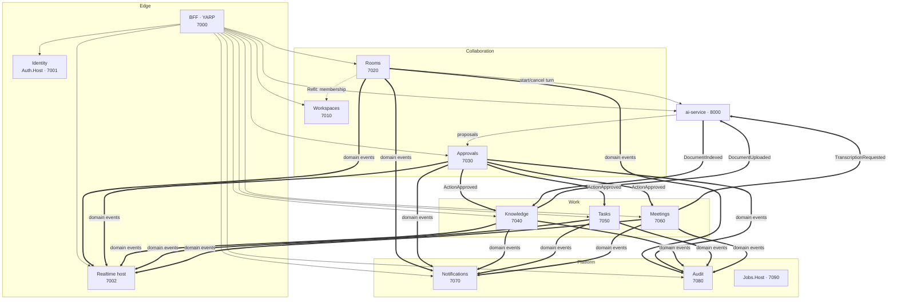

# Backend modules

| | |
|---|---|
| Status | **Accepted** 2026-10-09 — `CLAUDE.md`, `backend/CLAUDE.md` and `frontend/CLAUDE.md` follow this document |
| Date | 2026-10-08 |
| Rules | `.claude/skills/dotnet-modular-backend` (four projects per module, own DbContext and schema, events between modules, no cross-module references) |
| Related | `docs/SRS.md` §4 (functional requirements by module), `docs/architecture/realtime-collaboration.md`, ADR-0005, ADR-0006 (deployment profiles) |

## 1. Module map

Solid arrows: HTTP (Refit or BFF). Double arrows: integration events over RabbitMQ (Wolverine, ADR-0009). Dotted: read-only Refit lookups (cached).

## 2. Modules

Every module has the four projects from the skill (`Majlis.{Module}.Domain`, `.Application`, `.EntityFrameworkCore`, `.Tests`), its own schema and migrations, and one host `Majlis.{Module}.Host`.

### Identity — `identity` · `Majlis.Auth.Host` · 7001
- **Owns:** Tenant (data region, inference consent, plan, quotas, settings incl. driver-absence timeout), User (preferences, guest expiry), Group, Role, Permission grants at tenant level, SSO connections (OIDC/SAML), MFA, OpenIddict applications and tokens, support-access grants.
- **Publishes:** `TenantProvisioned`, `UserInvited`, `UserActivated`, `UserDeactivated`, `GroupMembershipChanged`, `TenantSettingsChanged`, `AccessRevoked`.
- **Consumes:** —
- **Notes:** issues tokens with `tenant_id`, `data_region`, and tenant-level roles. On-prem it also supports LDAP / Active Directory sign-in and licence-file activation, and the platform-admin console becomes a local admin console. Workspace permissions are **not** put in the token (they change too often); they are resolved by `PermissionHandler` from the cache (`IdentityEntitiesConsts.GetUserPermissionsCacheKey`) that Workspaces keeps up to date. Hosts the platform-admin console APIs (tenant provisioning). Also issues the real-time connection tickets (`/api/realtime/ticket` is routed here).

### Workspaces — `workspaces` · 7010
- **Owns:** Workspace, WorkspaceMember (user or group, role), Invitation, workspace agent instructions and glossary (terms with ar/en forms and definitions).
- **Publishes:** `WorkspaceCreated`, `WorkspaceArchived`, `MemberAdded`, `MemberRoleChanged`, `MemberRemoved` (+ `AccessRevoked`), `WorkspaceInstructionsChanged`.
- **Consumes:** `UserDeactivated`, `GroupMembershipChanged` (recompute effective permissions cache).
- **Notes:** the authority for "may user U do X in workspace W". It writes the effective permission set per user × workspace into Redis, which every module's `PermissionHandler` reads. The `ISecuredEntity` scope across all modules is the workspace.

### Rooms — `rooms` · 7020 (hot path)
- **Owns:** Room, RoomParticipant, AgentSession (control state, epoch), Turn, ToolCall (reference to approval), Citation, Comment, Suggestion, **SessionEvent log** (the per-session sequencer).
- **Publishes:** `SessionEventAppended` (every timeline event, for the Realtime host), `TurnRequested`, `TurnStopRequested`, `SessionEnded`, `ControlChanged`, `ParticipantAdded/Removed` (+ `AccessRevoked`), `MentionCreated`.
- **Consumes:** `TurnProgressed/TurnCompleted/TurnStopped/TurnFailed/ToolProposed/SummaryReady` (from ai-service), `ApprovalRequested/Decided/Executed/Expired` (from Approvals), `DriverPresenceLost/Restored` (from Realtime), `MemberRemoved`.
- **Calls:** ai-service `POST /internal/sessions/{id}/turns` with the driver's token; Workspaces (membership, cached).
- **Notes:** single writer of session state. Scale out horizontally — per-session ordering comes from the DB (row version + seq counter on `AgentSession`), not from in-memory state. Uses Wolverine's transactional outbox in the `rooms` schema so events are published only after commit and in order.

### Approvals — `approvals` · 7030
- **Owns:** ApprovalPolicy, ApprovalRequest (tool, args, preview/diff, risk, requester, origin session/turn, expiry), ApprovalDecision (approve/reject/edit-then-approve).
- **Publishes:** `ApprovalRequested`, `ApprovalDecided`, `ActionApproved {tool, args, approvalRequestId, requestedBy, approvedBy}`, `ActionRejected`, `ApprovalExpired`.
- **Consumes:** `ActionExecuted`, `ActionExecutionFailed` (from the owning modules), `MemberRemoved` (re-evaluate pending approvals).
- **Notes:** the only door for agent-originated writes. The tool → owning module map is configuration (`create_task → Tasks`, `draft_document → Knowledge`, …). Policy evaluation (who may approve, how many approvals, self-approval) is a domain service `ApprovalPolicyManager`. Expiry runs as a Hangfire job.

### Knowledge — `knowledge` · 7040
- **Owns:** Folder (ACL groups), Document, DocumentVersion (blob path, SHA-256, ingestion status), agent Drafts (Document with `Origin = Agent`, status Draft → Approved). (The glossary is owned by Workspaces.)
- **Publishes:** `DocumentUploaded {tenantId, workspaceId, documentId, versionId, blobUrl, aclGroups, language?}`, `DocumentDeleted`, `DocumentAclChanged`, `ActionExecuted` (for `draft_document`, `add_to_knowledge`).
- **Consumes:** `DocumentIndexed`, `DocumentIndexingFailed` (from ai-service), `ActionApproved` for its tools.
- **Notes:** uploads go to file storage through short-lived pre-signed URLs issued by Knowledge via `IBlobStorage` (Azure Blob SAS on cloud, S3 pre-signed URLs on-prem), directly from the browser, then `confirm`. Malware scan before `DocumentUploaded`. Exports (DOCX/PDF) of drafts are generated here.

### Tasks — `tasks` · 7050
- **Owns:** Task (assignee, due date, priority, status, origin, source session/turn, `ApprovalRequestId`).
- **Publishes:** `TaskCreated`, `TaskAssigned`, `TaskStatusChanged`, `TaskDue`, `ActionExecuted`.
- **Consumes:** `ActionApproved` for `create_task` / `update_task`, `MemberRemoved` (unassign).

### Meetings — `meetings` · 7060
- **Owns:** Meeting, Transcript (segments), Minutes, ActionItem.
- **Publishes:** `TranscriptionRequested` (to ai-service), `MinutesDrafted`, `ActionItemsProposed` (→ bulk approval through Approvals), `ActionExecuted`.
- **Consumes:** `TranscriptionCompleted/Failed`, `MinutesGenerated` (from ai-service), `ActionApproved` for `save_minutes`.
- **Notes:** recordings live in Blob Storage with their own retention (default 30 days after transcription).

### Notifications — `notifications` · 7070
- **Owns:** Notification, NotificationPreference, delivery log, device registrations (FCM) for mobile.
- **Publishes:** `NotificationCreated` (Realtime pushes it to `user:{id}`).
- **Consumes:** `MentionCreated`, `ApprovalRequested/Decided`, `ControlChanged` (hand-off offers, take-over notices), `TaskAssigned`, `TaskDue`, `DocumentIndexingFailed`, `UserInvited`.
- **Notes:** renders ar/en templates per recipient language, honors quiet hours and weekend days, sends email and push through `IEmailSender` / `IPushSender` (ADR-0006). Email and push carry **no content** by default ("You have a new approval request" + link); a tenant can opt in to content previews when its provider is in its data region.

### Audit — `audit` · 7080
- **Owns:** AuditEntry (append-only, hash chain per tenant).
- **Publishes:** —
- **Consumes:** an `IAuditable` marker on events from every module (sign-ins, role changes, control changes, approvals, tool executions, document access, exports, settings).
- **Notes:** write path is consume-only; read path is search + export for auditors. Separate database user with insert-only rights on the table.

### Non-module hosts

| Host | Port | Role |
|---|---|---|
| `Majlis.BFF.Host` | 7000 | YARP: `/api/{module}/**`, `/ai-api/**`, `/hubs/**` (WebSocket upgrade, sticky affinity for the fallback transports), security headers, compression, rate limits |
| `Majlis.Realtime.Host` | 7002 | SignalR `SessionHub`, presence, fan-out (design in `realtime-collaboration.md`). No database; Redis + RabbitMQ only |
| `Majlis.Jobs.Host` | 7090 | Hangfire: approval expiry, stuck-turn sweeper, presence `LastSeenAt` batch, retention purges, audit hash verification, nightly index reconciliation trigger |
| `Majlis.DbMigrator` | — | applies every module's migrations and seeds (permissions, default approval policies, lookups) |

## 3. Changes from the provisional list (step 1)

| Change | Why |
|---|---|
| **Added `Majlis.Realtime.Host`** (7002) | real-time fan-out scales by connections, not by API load; keeps the hub stateless and separate from Rooms' business logic |
| Ports renumbered so that module order follows the hot path: Workspaces 7010, Rooms 7020, **Approvals 7030, Knowledge 7040**, Tasks 7050, Meetings 7060, Notifications 7070, Audit 7080 | Approvals is part of the collaboration core |
| Real-time tickets issued by Identity | Identity already validates tokens and knows the user/tenant; avoids a second token service |
| Agent drafts confirmed in Knowledge, not a separate module | a draft is a document with a status; approval moves it into knowledge |

Nine modules stay: Identity, Workspaces, Rooms, Approvals, Knowledge, Tasks, Meetings, Notifications, Audit. No module was merged: each has a different owner, data shape and scaling profile, and the skill's one-schema-per-module rule keeps them cheap to separate later.

## 4. Deployment shape

Cloud is the priority and the only profile built now; on-prem follows the same code when needed (ADR-0006).

**`cloud` — one regional stamp per supported Azure region:**
- Azure Container Apps, one app per host, internal ingress for everything except the BFF; zone redundant; minimum 2 replicas for BFF, Realtime, Rooms and Approvals, 1 for the rest in non-prod.
- Azure SQL: one database `Majlis` with one schema per module (one login per module with rights on its schema only). The per-module DbContext lets a busy module (Rooms) move to its own database later without code changes.
- Azure Cache for Redis with key prefixes `majlis:{purpose}:` (permissions, presence, stream, snapshots, tickets, backplane); RabbitMQ with one vhost `majlis` and the Wolverine topology: one durable fanout exchange per event type (`majlis.{alias}`) and one queue per listening module (`{module}.{alias}`).

**`on-prem` — one installation per customer (built later, when the first on-prem customer is confirmed):**
- Helm chart for Kubernetes, or a Docker Compose bundle for a single server (small customers, pilots). Same images as the cloud.
- The customer's SQL Server, or a bundled one; Redis, RabbitMQ, MinIO and OpenSearch bundled or the customer's own; model servers (chat, embeddings, transcription, guard) as separate GPU workloads.
- Single tenant: the tenant is created at installation; the platform-admin APIs are disabled and a local admin console replaces them.

## 5. Cross-cutting contracts

- **Event contracts** shared by several modules live in `Majlis.Framework.Domain/Events/{Area}` (e.g. `ActionApproved`, `AccessRevoked`, `IAuditable`). Contracts consumed by ai-service are also described in `docs/architecture/events.schema.json` (written with the code) so Python uses the same shape.
- **Tool → module map** (Approvals config): `create_task`, `update_task` → Tasks; `draft_document`, `add_to_knowledge` → Knowledge; `save_minutes` → Meetings. A tool without an owning module cannot be registered as mutating.
- **Idempotency keys:** `clientRequestId` on commands, `approvalRequestId` on executions, `turnId` on AI results, `documentVersionId` on ingestion.

## 6. Decisions on the review questions (2026-10-09)

1. **Glossary:** owned by Workspaces; ai-service reads it through Refit and caches it.
2. **Email / push:** content-free by default; content previews only when the tenant opts in (see Notifications).
3. **Approvals of non-agent actions:** out of scope for the MVP; Approvals covers agent actions only.
