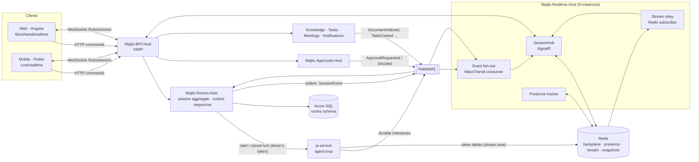
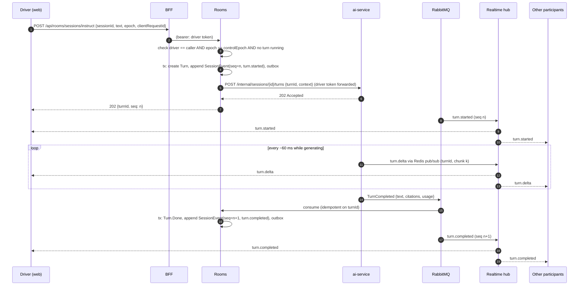
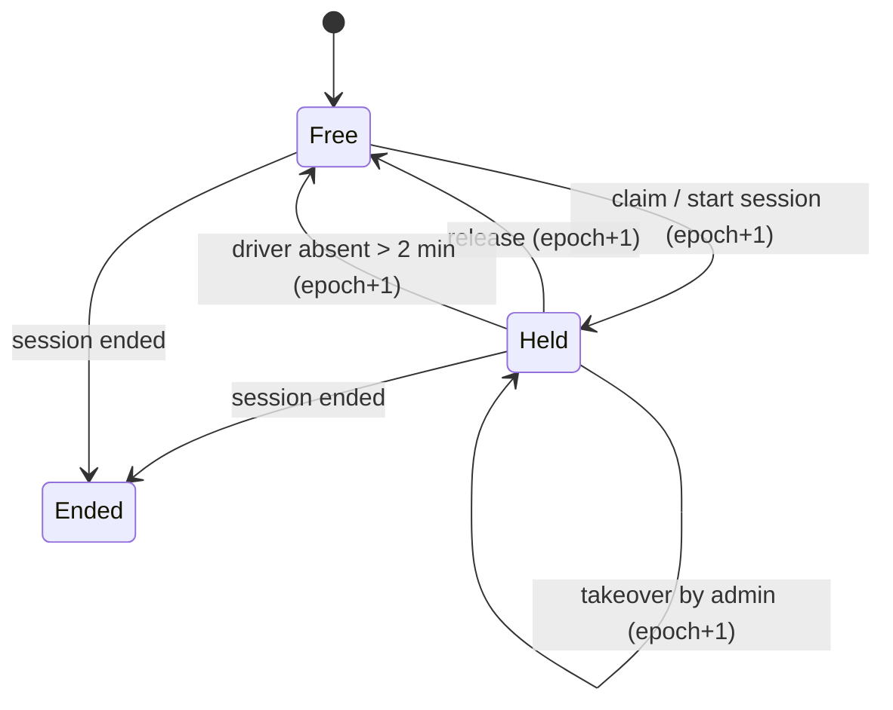

# Real-time collaboration architecture

| | |
|---|---|
| Status | **Accepted** 2026-10-09 |
| Date | 2026-10-08 |
| Covers | shared agent sessions, session control (driver, hand-off, take-over), presence, live updates, reconnect and replay |
| Requirements | FR-SES-001…014, FR-PRS-001/002, FR-APR-004, AI-AGT-002/004, AI-SHR-001/002, NFR-PRF-002/003/008, NFR-AVL-004/005, NFR-SEC-003 (`docs/SRS.md`) |
| Decisions | ADR-0001 … ADR-0004, ADR-0006 for deployment profiles (`docs/adr/`) |

---

## 1. The problem in one paragraph

Up to 25 people in a room watch **one** agent session. Only the **driver** can instruct the agent, but everyone sees its output stream token by token, sees its searches and tool proposals, comments and suggests, and sees approvals resolve. Control moves between people (request, hand-off, take-over, timeout) and must never be held by two people at once. People join late, lose Wi-Fi, switch devices, and must see exactly the same timeline as everyone else, in the same order, without reloading. All of this must work in the cloud (in the tenant's data region) and on-premises, on the house stack (.NET + Angular + Flutter + Python).

## 2. Decisions at a glance

| # | Decision | Why | ADR |
|---|---|---|---|
| 1 | **ASP.NET Core SignalR** in a dedicated **`Majlis.Realtime.Host`**, scaled out with a **Redis backplane**. WebSockets first, Server-Sent Events / long-polling fallback for locked-down government networks | native to the .NET stack, mature clients for Angular (`@microsoft/signalr`) and Flutter (`signalr_netcore`), groups and reconnect built in. The same design runs in the cloud and on-premises (Redis is available in both); a managed service would not exist on-prem | 0001 |
| 2 | **Commands go over HTTP, events come over the hub.** Every state change (instruct, stop, comment, hand off, approve) is a normal REST call through the BFF to an AppService. The hub only *pushes* events, plus a few ephemeral client signals (presence heartbeat, typing, viewing) | reuses the existing pipeline: permissions, FluentValidation, error shape, rate limits, audit, idempotency, retries. The hub stays a dumb, stateless fan-out that can restart at any time | 0002 |
| 3 | **The Rooms module is the single sequencer of every session.** Everything that appears in a session timeline becomes a `SessionEvent` with a per-session monotonic `seq`, written in the same transaction as the state change and published through the outbox | one total order that every client agrees on; late joiners and reconnecting clients replay from `seq`; no event can be shown but not stored | 0003 |
| 4 | **One driver at a time, protected by a fencing token** (`controlEpoch`). Every control change increments the epoch; every driver command carries the epoch it was issued under; a stale epoch is rejected with 409 | makes "two drivers" impossible even with races, double-clicks, reconnects and multiple tabs | 0004 |
| 5 | **Two lanes for agent output.** *Durable lane*: turn started, retrieval done, tool proposed, citations, turn completed/stopped/failed → sequenced `SessionEvent`s. *Stream lane*: token deltas and progress ticks → Redis pub/sub straight to the hub, never stored per token; the running text is kept in a Redis snapshot for late joiners | storing every token in SQL would be wasteful and slow; the final text is stored once in the `turn.completed` event. Deltas carry `(turnId, chunk)` so they order within the turn | 0003 |
| 6 | **Presence lives only in Redis** (TTL heartbeats), owned by the Realtime host | ephemeral by nature; no SQL writes for "who is looking" | 0001 |

## 3. Components



| Component | Owns | Does not |
|---|---|---|
| **Rooms** (module) | `AgentSession` aggregate, control state machine, turns, comments, suggestions, the `SessionEvent` log and its `seq` | push to sockets |
| **Realtime host** | SignalR hub, connection ↔ user ↔ group mapping, presence, fan-out of events from RabbitMQ and Redis | hold business state, accept commands that change data, talk to SQL |
| **ai-service** | the agent loop for one turn, token streaming, tool proposals | decide who may instruct (it trusts Rooms + the forwarded token), persist session state |
| **Approvals** | approval requests and decisions | write to the session timeline directly — Rooms appends approval events to the log |
| **BFF** | routing `/hubs/**` to the Realtime host (WebSocket upgrade), tickets → no tokens in URLs (§7) | — |

## 4. Event model

### 4.1 Envelope

Every message pushed to clients has one shape:

```json
{
  "v": 1,
  "type": "turn.completed",
  "scope": { "tenantId": "…", "workspaceId": "…", "roomId": "…", "sessionId": "…" },
  "seq": 1842,
  "turnId": "…",
  "at": "2026-10-08T12:00:00.123Z",
  "actor": { "kind": "user|agent|system", "id": "…", "displayName": "سارة" },
  "data": { }
}
```

- `seq` is present on **durable** session events only. It is gap-free per session (1, 2, 3 …).
- Stream-lane messages use `type: "turn.delta"` with `turnId` and `chunk` (per-turn counter) instead of `seq`.
- `data` never contains document text beyond what the user may already read (citations carry ids, title, page and a short passage the driver's retrieval was allowed to see; every viewer is at least a room member with read access to the room's knowledge scope — see §8 for the guest rule).

### 4.2 Event catalogue

| Type | Lane | Producer | Notes |
|---|---|---|---|
| `session.started` / `session.ended` | durable | Rooms | |
| `control.changed` | durable | Rooms | `{ from, to, kind: start\|claim\|handoff\|takeover\|release\|timeout, epoch, note? }` |
| `control.requested` / `control.request.resolved` | durable | Rooms | request control, accept/decline/expired |
| `handoff.offered` / `handoff.resolved` | durable | Rooms | hand-off waits for the receiver to accept |
| `turn.started` | durable | Rooms | `{ instruction, instructedBy, language, fromSuggestionId? }` |
| `turn.progress` | stream | ai-service | "searching 3 documents…", "drafting…" (localized keys + params) |
| `turn.delta` | stream | ai-service | coalesced text (≈ every 60 ms) |
| `turn.retrieval` | durable | ai-service → Rooms | documents searched and selected (ids, titles), for the "how I answered" panel |
| `turn.tool.proposed` | durable | ai-service → Rooms | tool, plain-language summary, `approvalRequestId` for mutating tools |
| `turn.completed` | durable | ai-service → Rooms | full final text, citations `S# → {documentId, versionId, page, passage}`, usage |
| `turn.stopped` / `turn.failed` | durable | Rooms / ai-service | partial text kept and marked |
| `comment.added` / `comment.edited` / `comment.deleted` | durable | Rooms | |
| `suggestion.added` / `suggestion.resolved` | durable | Rooms | resolved = sent / edited-and-sent / dismissed |
| `approval.requested` / `approval.decided` / `approval.executed` / `approval.expired` | durable | Approvals → Rooms | Rooms appends them to the log of the originating session |
| `summary.ready` | durable | ai-service → Rooms | hand-off summary, catch-me-up, end-of-session summary |
| `presence.snapshot` / `presence.changed` | ephemeral | Realtime | who is here, typing, following which turn |
| `room.updated`, `document.status`, `task.changed` | ephemeral (room/workspace scope) | various → Realtime | not in the session log; screens refetch on these hints |
| `notification.new` | ephemeral (user scope) | Notifications → Realtime | bell counter, toasts |

### 4.3 Groups

| Group | Members | Carries |
|---|---|---|
| `session:{sessionId}` | connections viewing that session | session events, deltas, session presence |
| `room:{roomId}` | connections with that room open | room presence, room-level hints (new session, documents, tasks) |
| `ws:{workspaceId}` | connections on the workspace home | "active now" counts per room, approvals badge |
| `user:{userId}` | every connection of that user | notifications, approval requests addressed to them, control requests/offers to them, forced leave |

## 5. Key flows

### 5.1 Driver sends an instruction



- `clientRequestId` makes the command idempotent (double-click, retry after timeout).
- Only **one turn runs per session** at a time. A second instruct while a turn is running returns 409 `Rooms:Session:TurnInProgress` (the UI offers *Stop and redirect*).
- ai-service writes the growing text to `turn:{turnId}:text` in Redis (TTL 10 min) so a participant who joins mid-stream sees the text so far and then continues with deltas (`chunk` tells it where it is).
- ai-service sends a heartbeat (`turn:{turnId}:hb`, every 5 s). A Hangfire job in Rooms fails turns with no heartbeat for 30 s (`turn.failed`, reason `AiUnavailable`), so a crashed worker never leaves a session stuck.

### 5.2 Stop and redirect

1. Driver: `POST /api/rooms/sessions/stop {sessionId, turnId, epoch}`.
2. Rooms checks driver + epoch, sets `Turn.StopRequested`, writes `turn:{turnId}:cancel` in Redis and publishes `TurnStopRequested`.
3. ai-service checks the cancel key between deltas and between tool iterations (≤ 100 ms reaction), stops the model stream, and reports `TurnStopped {partialText}`.
4. Rooms appends `turn.stopped` (partial text kept, marked stopped).
5. *Redirect* in the UI = stop + instruct, sent as one `POST …/redirect`; Rooms orders them in one transaction.

### 5.3 Control: request, hand-off, take-over, timeout



- **State** on `AgentSession`: `DriverUserId`, `ControlEpoch` (long), `PendingHandOffTo`, `PendingRequests[]`, SQL `rowversion` for optimistic concurrency. All transitions are AppService methods in Rooms (`ClaimControlAsync`, `RequestControlAsync`, `ResolveControlRequestAsync`, `OfferHandOffAsync`, `ResolveHandOffAsync`, `TakeOverAsync`, `ReleaseControlAsync`), each one transaction that bumps the epoch and appends `control.changed`.
- **Fencing:** commands that only a driver may send (`instruct`, `stop`, `redirect`, `sendSuggestion`, `offerHandOff`, `release`) carry `epoch`. If `epoch != ControlEpoch` → 409 `Rooms:Session:ControlChanged`, and the client re-reads state. A user with two tabs open is the same user, so either tab can drive; the epoch still prevents a stale tab from acting on an old state.
- **Hand-off** needs the receiver to accept (FR-SES-008); the offer expires after 5 minutes. **Asynchronous hand-off** (FR-SES-012) is the same offer, delivered to `user:{id}` plus a notification, with a `summary.ready` generated for the receiver; it does not expire until the session ends or the driver withdraws it.
- **Take-over** needs `Permissions.Rooms.TakeOverSession`; the previous driver gets a `user:{id}` notice; audited.
- **Timeout:** the Realtime host knows when the driver's last connection to `session:{id}` disappears and publishes `DriverPresenceLost {sessionId, userId, epoch}`. Rooms schedules a MassTransit delayed message for the **driver-absence timeout** — a tenant setting (default 2 min, 30 s – 30 min) that a workspace can override (FR-SES-010), read when the timer is scheduled; when it fires, if the epoch is unchanged and the driver has not come back (`DriverPresenceRestored` clears it), Rooms frees control. Using the epoch makes stale timers harmless.
- **Mid-turn change:** the running turn finishes under the old driver's identity (AI-SHR-002); the new driver can stop it. The next turn runs with the new driver's token, permissions and knowledge access (FR-SES-011).

### 5.4 Agent proposes a change → approval

1. During a turn the model calls `create_task`. ai-service sees `mutates: true` → calls Approvals `POST /api/approvals/requests` with the driver's token (permission and policy checked there) → gets `approvalRequestId` → reports `turn.tool.proposed` and tells the model the action is *pending approval*.
2. Approvals publishes `ApprovalRequested` → Rooms appends `approval.requested` to the session (everyone in the room sees the card) → Notifications + `user:{approverId}` for approvers not in the room.
3. An approver approves (HTTP to Approvals) → `ApprovalDecided` → Rooms appends `approval.decided` → `ActionApproved` is consumed by Tasks, which executes **idempotently** (key = `approvalRequestId`), re-checking that the requester still holds `Permissions.Tasks.CreateTask` → `ActionExecuted` → Rooms appends `approval.executed`.
4. If the session is still active, Rooms asks ai-service to post a short follow-up into the session ("Task created: …"), as a system turn without a model call when possible.

### 5.5 Join, late join and reconnect

1. Client opens the room: `POST /api/rooms/sessions/getbyid` → returns session state (driver, epoch, pending requests) and the **last 200 events** with `lastSeq`.
2. Client connects to the hub and calls `JoinSession(sessionId, lastSeq)`.
3. The hub authorizes (§8), adds the connection to `session:{id}`, and replies with any events after `lastSeq` that it receives while joining (to close the race between steps 1 and 2) plus the presence snapshot and, if a turn is streaming, `{turnId, textSoFar, chunk}` from the Redis snapshot.
4. The client keeps a **reorder buffer**: it applies events strictly in `seq` order. If it sees `seq` jump (e.g. 105 after 102) it waits 500 ms, then fetches the gap with `POST /api/rooms/sessions/events {sessionId, afterSeq: 102}`.
5. On disconnect, SignalR reconnects automatically (0, 2, 5, 10, 30 s, then every 30 s). After reconnecting, the client calls `JoinSession` again with its `lastSeq`; no reload.
6. Older history loads by paging the same `events` endpoint backwards.

### 5.6 Presence

- Each connection sends `Heartbeat(roomId, sessionId?, state)` every 15 s; `state` = `active | idle | typing:comment | typing:suggestion | viewing:{turnId}`. Typing is throttled to one signal per 3 s.
- Redis: `presence:room:{roomId}` = hash `connectionId → {userId, state, device, at}` with per-entry expiry handled by the hub (entries older than 45 s are dropped). Changes are broadcast as `presence.changed` (debounced 250 ms per room).
- Workspace "active now" counts are derived from room presence and pushed to `ws:{id}` at most every 5 s.
- Presence never goes to SQL. `RoomParticipant.LastSeenAt` is updated at most every 5 minutes by a batch job (for "last seen" and sorting).

## 6. Scale and performance

**MVP load** (NFR-SCL-001): 1 000 concurrent connections, 300 active sessions, ≤ 25 participants per room.

| Concern | Estimate / budget |
|---|---|
| Streaming turns at peak | assume 100 at once × 16 deltas/s (60 ms coalescing) = 1 600 publishes/s into Redis; the backplane sends each once per hub instance, then each instance fans out locally to ≤ 25 sockets → ≤ 40 000 socket writes/s across the cluster |
| Hub instances | 2 minimum (zone-redundant), autoscale on connections (target 3 000 per instance) and CPU |
| Delta size | ≤ 2 KB per message; total message cap 32 KB (the hub rejects bigger) |
| Latency budget for NFR-PRF-002 (p95 ≤ 300 ms) | Rooms commit + outbox ≤ 50 ms, RabbitMQ ≤ 20 ms, backplane ≤ 20 ms, socket ≤ 100 ms in-Kingdom, client render ≤ 50 ms |
| Control change (NFR-PRF-008, ≤ 1 s) | one Rooms transaction + one durable event; no model call involved |
| Protocol | JSON for MVP (debuggable); MessagePack later if bandwidth matters |
| Load test | 2× MVP load (2 000 connections, 200 simultaneous streaming turns) before GA, with k6 + a SignalR client script |

## 7. Connection security and authentication

- **No tokens in URLs.** Browsers cannot set headers on WebSocket upgrades, so the client first calls `POST /api/realtime/ticket` (bearer token, normal API) and gets a **single-use ticket** valid 30 s, bound to user, tenant and client IP, stored in Redis. It connects with `/hubs/session?ticket=…`; the hub consumes the ticket and builds the user principal from it. Tickets are redacted in all logs. Mobile can send the bearer header directly but uses the same ticket flow for one code path.
- The connection is **re-authorized every 10 minutes** (access tokens live ≤ 15 min): the client refreshes its token, gets a new ticket and calls `Reauthenticate(ticket)`; connections that miss it are closed with a `reauth_required` reason and reconnect.
- Origin check on the hub against the configured allow-list; WebSocket only over TLS; rate limits per connection (heartbeats 1/5 s, typing 1/3 s, joins 10/min).

## 8. Authorization

- `JoinRoom` / `JoinSession` / `JoinWorkspace`: the hub asks Rooms/Workspaces (Refit, cached 60 s in Redis per `user × room`) whether the user may read the room. Guests may join only rooms they were invited to.
- **Revocation:** when a user is removed from a room or workspace, deactivated, or loses a role, the owning module publishes `AccessRevoked {userId, scope}`. The hub removes that user's connections from the affected groups immediately and sends `access.revoked` to `user:{id}`; the cache entry is deleted.
- **What viewers can see:** room members see the session timeline, including citations. Because the agent retrieves with the **driver's** access, an answer can cite a document a *viewer* cannot open. Rule: citation metadata (title, page, short passage) is visible to all room members, opening the full document still checks the viewer's own access (FR-KNW-003). Room knowledge scope settings warn when a room includes members who cannot read part of the scope. *(Product decision to confirm — alternative: restrict retrieval to the intersection of all participants' access, which is safer but surprises drivers.)*
- Hub methods never change business data; the only state they touch is presence.

## 9. Failure handling

| Failure | Effect | Handling |
|---|---|---|
| A hub instance dies | its clients disconnect | automatic reconnect to another instance, `JoinSession(lastSeq)` replays the gap; presence entries expire in ≤ 45 s |
| Redis unavailable | no fan-out, no presence | clients fall back to polling `events` every 3 s (banner "live updates delayed"); commands keep working (they don't depend on Redis, except stop's fast path, which falls back to the RabbitMQ message) |
| RabbitMQ unavailable | events delayed | the outbox keeps them in SQL and publishes when the broker is back, in order; commands still succeed |
| ai-service crash mid-turn | stream stops | heartbeat timeout → `turn.failed`; partial text from the Redis snapshot is kept |
| ai-service unavailable | no new turns | instruct returns 503 `General:Errors:AiBusy`; rooms, comments, approvals, tasks keep working (NFR-AVL-004) |
| Duplicate messages | — | every consumer is idempotent (turnId, approvalRequestId, clientRequestId); clients drop events with `seq ≤ lastSeq` |
| Clock skew | — | ordering never uses timestamps, only `seq` and `chunk` |

## 10. Client libraries

**Web — `libs/shared/realtime` (tag `type:core`):**
- `RealtimeConnectionService`: one `HubConnection` per tab, ticket flow, reconnect policy, re-auth timer, connection state as a signal (`connected | reconnecting | offline`).
- `SessionChannel`: `join(sessionId, lastSeq)`, reorder buffer, gap fetch, typed event stream (`Observable<SessionEvent>`), stream-lane merging into the current turn text.
- `PresenceService`: heartbeats (paused when the tab is hidden for > 2 min → `idle`), typed presence signal.
- Event types generated from one JSON Schema (`docs/architecture/events.schema.json`, written with the code) so Angular, Flutter and Python share the same contract.
- The room screen's `room-session.facade.ts` (feature `rooms`) composes these into signals: `timeline`, `currentTurn`, `driver`, `canInstruct`, `participants`, `pendingApprovals`.

**Mobile — `core/realtime`:** the same protocol with `signalr_netcore`; connects only while a room screen is open in the foreground, and relies on push notifications otherwise. Never queues instructions or approvals offline (see `mobile/CLAUDE.md`).

**ai-service:** publishes stream-lane messages to Redis (`session:{id}:stream` channel) and durable milestones to RabbitMQ; exposes `POST /internal/sessions/{sessionId}/turns` (internal network only, not routed by the BFF) and reads cancel keys.

## 11. Data residency and deployment profiles

Every component in this design runs where the tenant's data lives: in the tenant's regional stamp on the `cloud` profile (Realtime host, Azure Cache for Redis, RabbitMQ, Azure SQL), or inside the customer's data center on the `on-prem` profile (the same components, self-hosted). Nothing in the real-time path depends on an Azure-only service, so it needs no adapter (ADR-0006). Azure SignalR Service / Web PubSub are not used, because they would not exist on-prem.

## 12. Decisions on the review questions (2026-10-09)

1. **Citation visibility for viewers with less access than the driver:** accepted as proposed. Citation metadata (title, page, short passage) is visible to all room members; opening the full document checks the viewer's own access; room settings warn about members who cannot read part of the knowledge scope.
2. **Driver-absence timeout:** configurable per tenant, overridable per workspace; default 2 minutes (§5.3).
3. **Driver's devices:** any connection of the driver's own account may drive (accepted as proposed).
4. **Session history retention:** follows FR-ADM-003, default 365 days (accepted as proposed).
